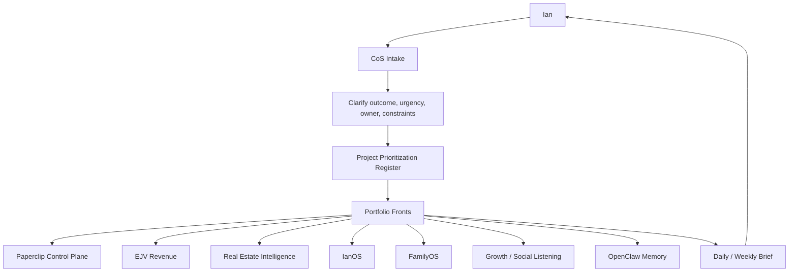

# Chief of Staff Operating Layer

Date: 2026-05-14

Purpose: define the one-front-door operating model for Ian so Paperclip can coordinate multiple project fronts without making Ian manage every agent company directly.

## Role

The Chief of Staff Office is the routing and accountability layer between Ian and all Paperclip fronts.

It should not replace Ian's judgment. It should reduce the number of loose threads Ian has to carry.

## Mission

1. Capture Ian's requests.
2. Clarify the intended outcome.
3. Route work to the right front.
4. Maintain the prioritization register.
5. Track commitments and blockers.
6. Return concise decision-ready briefs.
7. Protect budget, quota, and attention.

## Operating Map



## Intake Contract

Every request should be normalized into:

| Field | Meaning |
| --- | --- |
| Request | What Ian asked for |
| Desired outcome | What should be true when done |
| Front | Which portfolio front owns it |
| Urgency | Now, this week, later |
| Evidence | What proof of progress is expected |
| Budget risk | Free/local, cheap, standard, premium |
| Approval needed | Whether Ian must approve before execution |
| Next action | The next concrete move |

## Routing Rules

| Request Type | Primary Front |
| --- | --- |
| Paperclip reliability, quota, agent routing, GitHub portability | Paperclip Control Plane |
| Cross-front prioritization, daily brief, open-loop tracking | Chief of Staff Office |
| Customer discovery, pipeline, outreach, venture revenue | EJV Labs Revenue Engine |
| Portfolio reporting, property performance, operating KPIs | Real Estate Portfolio Intelligence |
| Market screening, MSA analysis, acquisition underwriting | Acquisition Analysis Tool |
| Personal executive dashboard | IanOS |
| Household/family workflows | FamilyOS |
| Market/social signals | Growth and Social Listening |
| Telegram/mobile command flow | Telegram Command Channel |
| Local/open model benchmarking | Local Worker Pool |
| Durable memory and identity | OpenClaw Memory Integration |

## Briefing Cadence

### Daily Brief

Purpose: let Ian start the day with the few things that matter.

Template:

```text
Top outcomes:
1.
2.
3.

Decisions needed from Ian:
1.
2.

Blocked:
1.

Quota/cost state:

Recommended next move:
```

### Weekly Portfolio Review

Purpose: decide what to promote, pause, or demote.

Template:

```text
Fronts advanced:

Score changes:

Evidence created:

Spend/quota:

Promote / pause / continue:

Next week's focus:
```

## Approval Gates

The CoS must ask Ian before:

- unpausing agents
- resuming routines
- creating new companies or agents
- changing budgets or premium model routes
- sending external communications
- accessing sensitive personal/family/business systems
- running high-volume scraping, social listening, or outreach

## First Implementation Slice

1. Keep CoS as an operating layer, not a new agent/company yet.
2. Add CoS templates to the project register.
3. Create a daily brief document on the CoS front issue.
4. Use Paperclip comments as the durable record.
5. Only make CoS an actual agent after Paperclip smoke tests pass.

## Success Metrics

| Metric | Target |
| --- | --- |
| Ian decisions surfaced clearly | Daily |
| Open loops tracked | 100% of active fronts |
| Front status updated | Weekly |
| Surprise quota events | Zero |
| Work without evidence | Declining to zero |
| Number of things Ian must personally remember | Lower each week |

## Near-Term CoS Backlog

1. Build the daily brief template into Paperclip.
2. Add a weekly portfolio review template.
3. Add a lightweight open-loop register.
4. Link every active front issue to the Priorities page.
5. Define the future CoS agent instructions, but do not activate it yet.
