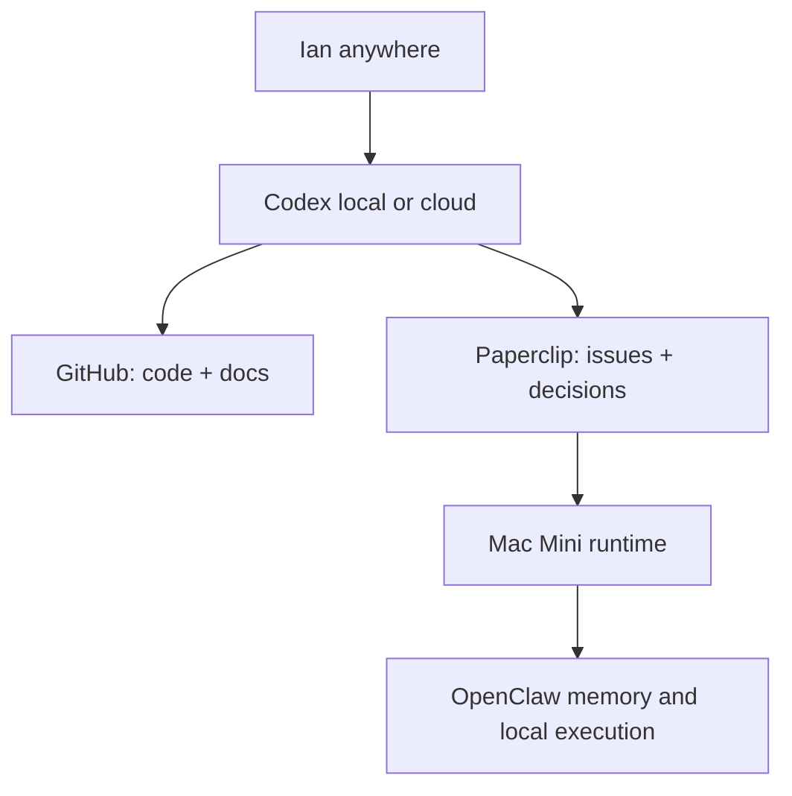

# Cloud Portability Plan

Goal: Ian can work with this project from any desktop, MacBook, or phone through Codex, without being trapped in one local session.

## Target Shape

## Responsibilities

| Layer | Responsibility |
| --- | --- |
| GitHub | Portable source of truth for code, docs, and handoff files |
| Paperclip | Operating memory, issue state, decisions, agent assignments |
| Mac Mini | Local runtime for Paperclip, OpenClaw, and local adapters |
| Codex | Portable collaborator that can rehydrate from GitHub and Paperclip |
| Tailscale | Private network access to the Mac Mini-hosted Paperclip instance |

## Practical Flow

1. Start Codex anywhere.
2. Give it the GitHub repo and branch.
3. Tell it to read `docs/CODEX_START_HERE.md`.
4. If it can reach Paperclip, have it inspect `IAN-66` and the dashboard.
5. If it cannot reach Paperclip, have it work from GitHub docs and prepare changes for later sync.

## Access Modes

### Local Desktop

Best for live Paperclip work because it can reach Tailscale and SSH to the Mac Mini.

### MacBook

Install Tailscale, join the tailnet, then use the same Paperclip URL:

`https://ians-mac-mini-1.tail403c1a.ts.net`

### Phone

Use GitHub and Codex for review, planning, and lightweight edits. Use Paperclip in the browser if Tailscale access is available on the phone.

### Cloud Codex

Cloud Codex should be expected to access GitHub. It may not be able to reach the Tailnet-hosted Paperclip instance unless a secure bridge is added later.

Cloud-safe workflow:

- read GitHub docs
- make code/doc changes on a branch
- open a PR or push a branch
- avoid actions requiring live Paperclip unless the environment has network access

## Next Infrastructure Options

1. Keep Paperclip private on Tailscale for now.
2. Add a secure public read-only bridge later if cloud Codex needs live Paperclip context.
3. Add GitHub Actions for tests so cloud work gets immediate validation.
4. Consider a small Paperclip export command that writes current company state to `docs/live-state/` for offline/cloud Codex sessions.

## Non-Goals For Now

- Do not expose Paperclip publicly without auth hardening.
- Do not move Paperclip off the Mac Mini yet.
- Do not make cloud Codex the runtime for agents.
- Do not let portability become an excuse to resume autonomous work before quota visibility is fixed.
