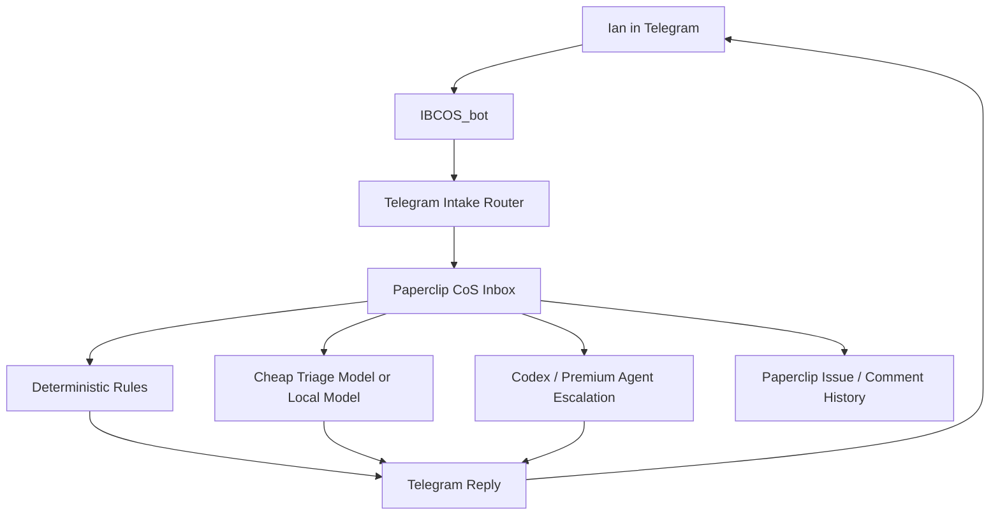

# Cost-Optimized Communication Architecture

Date: 2026-05-14

Purpose: make Telegram feel like an always-available Chief of Staff while keeping Paperclip as the system of record and preventing runaway model spend.

## Goal

Ian should be able to message Telegram naturally from phone, away from the computer, and wake up to useful continuity:

- captured thoughts
- lightweight answers to direct questions
- clear open loops
- priority and project signals
- escalation items that need Codex or a premium agent

The system should not require Ian to pre-sort thoughts or remember strict syntax.

## Core Principle

Use the cheapest layer that can safely do the job.

Conversation should feel continuous, but expensive reasoning should be opt-in, capped, and auditable.

## Architecture



## Communication Tiers

| Tier | Use | Worker | Cost | Example |
| --- | --- | --- | --- | --- |
| 0. Routing | Capture, classify, link, confirm | deterministic code | near-zero | create CoS Inbox item |
| 1. Status | Known answers from Paperclip state | deterministic/API | near-zero | `status`, `issues`, `agents` |
| 2. Lightweight response | Simple question, summary, next step | local/small model | low | "what did I send today?" |
| 3. Codex review | Codebase, docs, planning, async judgment | Codex | moderate/capped | roadmap update |
| 4. Premium agent | nuanced strategy or high-stakes judgment | Sonnet-class | higher/capped | product/company decision |

## Default Message Handling

Telegram private messages from Ian are handled as follows:

1. Slash command: execute command.
2. `pc` command: execute shorthand command.
3. Reply to Paperclip message: add comment to the mapped issue.
4. Plain message: create a CoS Inbox issue with intent label.

Current first-pass intent labels:

- `Question for CoS`
- `Task candidate`
- `Idea`
- `Parking lot`
- `Brain dump`

## Conversational Loop

The desired loop is asynchronous but feels alive:

1. Ian sends a thought or question.
2. Paperclip creates or updates a CoS Inbox thread.
3. Telegram confirms and asks Ian to reply to continue the thread.
4. A responder posts a reply/comment.
5. Telegram sends the reply back to Ian.

Important boundary: Telegram is the mobile surface. Paperclip remains the record.

## Cost Controls

Hard rules for the first live version:

- Always-on Telegram listener is allowed.
- Deterministic routing is allowed.
- Lightweight responder may answer direct questions only.
- Max one responder run at a time.
- Max 10 model-generated Telegram replies overnight until approved otherwise.
- No delegation from the responder.
- No broad repo scans from the responder.
- No premium model fallback without explicit approval.
- Stop responder if quota visibility is unavailable.
- Stop responder if Paperclip health fails.
- Stop responder if it generates repeated or low-value replies.

## Overnight Responder Shape

A safe first responder should be narrow:

Input:

- issue title
- latest Telegram message
- last 3 comments in the thread
- current priorities summary
- active blocked items summary

Output:

- a concise Telegram reply
- optional Paperclip comment
- optional tag suggestion
- escalation flag if deeper work is needed

It should not:

- change budgets
- unpause routines
- create agents
- run code
- send external communications
- scrape external systems
- make financial or legal decisions

## Escalation Rules

Escalate to Codex or a premium agent when:

- user asks for code changes
- answer depends on repo state
- question requires architecture judgment
- decision affects budget, agents, routines, or deployment
- message includes sensitive finance/legal/HR content
- responder confidence is low

Escalation result should be visible in Telegram:

```text
I captured this and marked it for Codex review tomorrow. No agent spend triggered overnight.
```

## Tomorrow Build Plan

1. Preserve current Telegram capture and thread mapping.
2. Add Paperclip comment-to-Telegram outbound routing.
3. Add a CoS Inbox view/filter in the UI.
4. Add deterministic `inbox`, `questions`, and `today` Telegram commands.
5. Add a capped lightweight responder for direct questions.
6. Add usage counters visible in Paperclip.
7. Only then consider waking the CEO/CoS agent on selected threads.

## Success Criteria

By the end of the next build slice:

- Ian can send a plain Telegram thought and see it in Paperclip.
- Ian can reply to the Telegram confirmation and see the reply as a Paperclip comment.
- Paperclip comments can be sent back to the same Telegram thread.
- `pc help` explains the workflow.
- The responder cannot exceed the configured overnight cap.
- Agent unpause remains a deliberate decision, not a side effect of chat.

## Open Decisions

- Keep one bot or split Brain Dump into a second bot after trial.
- Choose first lightweight responder route: local model, cheap cloud model, or Codex-on-demand.
- Decide whether direct questions should get immediate replies tonight or only be prepared for tomorrow.
- Decide digest cadence: morning only, evening only, or both.
