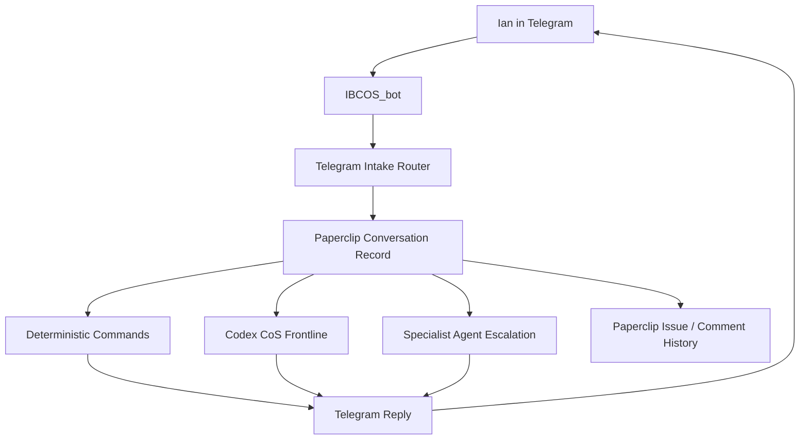

# Cost-Optimized Communication Architecture

Date: 2026-05-14

Purpose: make Telegram feel like an always-available Chief of Staff while keeping Paperclip as the system of record and preventing runaway model spend.

## Goal

Ian should be able to message Telegram naturally from phone, away from the computer, and wake up to useful continuity:

- captured thoughts
- lightweight answers to direct questions
- clear open loops
- priority and project signals
- escalation items that need Codex or a premium agent

The system should not require Ian to pre-sort thoughts or remember strict syntax.

## Core Principle

Use the cheapest layer that can safely do the job, except the human-facing CoS conversation layer should be smart enough to keep pace with Ian.

Conversation should feel continuous. Expensive downstream work should be opt-in, capped, and auditable.

## Architecture



## Communication Tiers

| Tier | Use | Worker | Cost | Example |
| --- | --- | --- | --- | --- |
| 0. Commands | Status, issue lists, deterministic actions | deterministic code | near-zero | `pc status` |
| 1. Status | Known answers from Paperclip state | deterministic/API | near-zero | `status`, `issues`, `agents` |
| 2. CoS conversation | Natural language conversation with Ian | Codex on demand | moderate/capped | "help me think through this" |
| 3. Local model support | Cheap tagging, summaries, enrichment | Ollama/local model | low | categorize notes overnight |
| 4. Premium agent | nuanced strategy or high-stakes judgment | Sonnet-class | higher/capped | product/company decision |

## Default Message Handling

Telegram private messages from Ian are handled as follows:

1. Slash command: execute command.
2. `pc` command: execute shorthand command.
3. Reply to Paperclip message: add comment to the mapped issue.
4. `cx` or `codex wake`: create an explicit Codex Wake issue.
5. Plain natural-language message: create a Paperclip conversation record, wake the Codex Engineer on demand, and reply in Telegram without exposing routing labels.

Intent labels can still be stored in Paperclip for retrieval and prioritization, but they should not be shown in normal Telegram chat:

- `Question for CoS`
- `Task candidate`
- `Idea`
- `Parking lot`
- `Brain dump`

## Conversational Loop

The desired loop is asynchronous but feels alive:

1. Ian sends a thought or question.
2. Paperclip creates or updates the conversation record in the background.
3. Codex wakes on demand when the message is substantive.
4. Telegram replies naturally, without "captured", "brain dump", or "routed" receipts.
5. Paperclip comments remain the durable record and can bridge back to Telegram.

Important boundary: Telegram is the mobile surface. Paperclip remains the record.

## Cost Controls

Hard rules for the first live version:

- Always-on Telegram listener is allowed.
- Deterministic routing is allowed.
- Codex Engineer wake-on-demand is the target state for Ian's normal CoS conversation, but remains disabled until the `codex_local` API callback path is fixed.
- Codex scheduled heartbeats/routines remain disabled.
- Max one Codex CoS run at a time.
- Track Codex CoS routed messages, invoked runs, and estimated prompt tokens.
- No delegation from the responder.
- No broad repo scans from the responder.
- No premium model fallback without explicit approval.
- Stop responder if quota visibility is unavailable.
- Stop responder if Paperclip health fails.
- Stop responder if it generates repeated or low-value replies.

## Overnight Responder Shape

A safe first responder should be narrow:

Input:

- issue title
- latest Telegram message
- last 3 comments in the thread
- current priorities summary
- active blocked items summary

Output:

- a concise Telegram reply
- optional Paperclip comment
- optional tag suggestion
- escalation flag if deeper work is needed

It should not:

- change budgets
- unpause routines
- create agents
- run code
- send external communications
- scrape external systems
- make financial or legal decisions

## Escalation Rules

Escalate to Codex or a premium agent when:

- user asks for code changes
- answer depends on repo state
- question requires architecture judgment
- decision affects budget, agents, routines, or deployment
- message includes sensitive finance/legal/HR content
- responder confidence is low

Escalation result should be visible in Telegram:

```text
I am here. I am picking this up now.
```

## Tomorrow Build Plan

1. Preserve current Telegram capture and thread mapping.
2. Add Paperclip comment-to-Telegram outbound routing.
3. Add a CoS Inbox view/filter in the UI.
4. Add deterministic `inbox`, `questions`, and `today` Telegram commands.
5. Add a capped lightweight responder for direct questions.
6. Add usage counters visible in Paperclip.
7. Keep CEO/CTO/Coder agents paused until Codex CoS routing is reliable.

## Live Runtime Notes

As of 2026-05-15:

- The installed Telegram plugin has a singleton worker lock at `/tmp/paperclip-telegram-worker.lock` so duplicate Paperclip processes cannot both answer Telegram.
- Normal private Telegram messages default to the Codex CoS lane. Ian does not need to type `cx`.
- Visible replies should be natural acknowledgements, not internal routing receipts.
- `pc ...` remains the deterministic command namespace.
- `cx ...` and `codex wake ...` remain explicit manual wake shortcuts.
- A live test proved the Telegram route can wake Codex, but also exposed a cost risk: the `codex_local` runtime could not reach the Paperclip API callback URL from its sandbox and started continuation runs trying to post back.
- Current safe state: Codex Engineer is `idle` with `heartbeat.enabled=false` and `heartbeat.wakeOnDemand=false`.
- Next required build step: fix the `codex_local` runtime API callback path before re-enabling Telegram-to-Codex live answers.

## Success Criteria

By the end of the next build slice:

- Ian can send a plain Telegram thought and see it in Paperclip.
- Ian can reply to the Telegram confirmation and see the reply as a Paperclip comment.
- Paperclip comments can be sent back to the same Telegram thread.
- `pc help` explains the workflow.
- The responder cannot exceed the configured overnight cap.
- Agent unpause remains a deliberate decision, not a side effect of chat.

## Open Decisions

- Keep one bot or split Brain Dump into a second bot after trial.
- Choose first lightweight responder route: local model, cheap cloud model, or Codex-on-demand.
- Decide whether direct questions should get immediate replies tonight or only be prepared for tomorrow.
- Decide digest cadence: morning only, evening only, or both.
