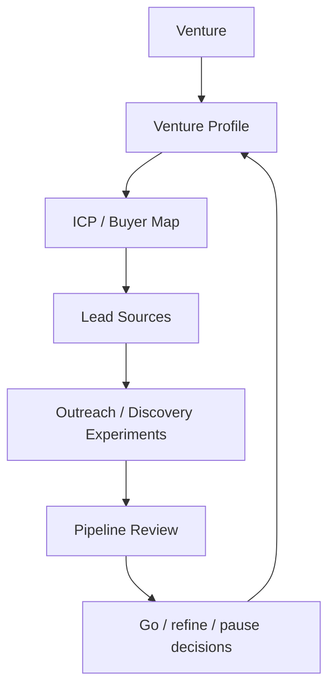

# EJV Labs Revenue Engine Front Pack

Date: 2026-05-14

Purpose: define the first repeatable operating framework for helping EJV Labs ventures get customers and revenue through Paperclip.

## Mission

Help one live venture move closer to revenue through a disciplined weekly loop:

1. Pick a venture.
2. Define the ICP and buyer.
3. Identify reachable leads.
4. Run small outreach or discovery experiments.
5. Track evidence.
6. Review pipeline and decide the next move.

## Operating Map



## Venture Profile Template

```text
Venture:
Website:
Current stage:
Product:
Primary customer:
Pain solved:
Current traction:
Revenue model:
Known constraints:
Founder/team owner:
Why now:
```

## ICP Template

```text
Best-fit customer:
Buyer title:
Economic buyer:
User:
Trigger event:
Pain intensity:
Current alternative:
Budget source:
Objections:
Proof needed:
```

## Lead Source Map

| Source | Use | Cost/Risk |
| --- | --- | --- |
| Existing network | Warm intros and validation | Low cost, high context |
| LinkedIn/manual research | Buyer/persona mapping | Low/medium cost |
| Industry directories | Account list creation | Medium data quality |
| Website/contact pages | Direct account enrichment | Slow but cheap |
| Social listening | Trigger discovery | Needs cost control |
| CRM/email history | Warm leads and prior context | Requires access approval |

## Outreach Experiment Template

```text
Experiment name:
Hypothesis:
Target ICP:
Lead source:
Message:
Volume:
Success metric:
Stop condition:
Owner:
Review date:
```

## Weekly Revenue Review

```text
Pipeline movement:

New leads:

Customer conversations:

Signals learned:

Blocked:

Next experiments:

Decisions needed from Ian:
```

## Evidence Types

| Evidence | Meaning |
| --- | --- |
| Lead list | Candidate customers identified |
| ICP memo | Customer focus sharpened |
| Message test | Positioning tested |
| Discovery notes | Pain and buying process learned |
| Call booked | Demand signal |
| Proposal / LOI / sale | Revenue signal |

## First 30 Days

1. Pick one venture.
2. Fill in venture profile and ICP.
3. Build first 25-account lead list manually.
4. Draft two outreach/discovery messages.
5. Run one small experiment only after Ian approves external outreach.
6. Create weekly revenue review.
7. Measure cost per useful revenue artifact.

## Success Criteria

- One venture has a live weekly revenue operating cadence.
- ICP and buyer are explicit.
- First lead list exists.
- Experiments are tracked with evidence.
- Ian can see pipeline movement and next decisions.

## Open Questions For Ian

1. Which venture should be first?
2. What is the most important two-week outcome: discovery calls, qualified leads, signed customers, strategic partners, or investor/customer validation?
3. Is external outreach approved yet, or should the first pass stay internal/research-only?
4. Where does current venture/customer data live?
5. What messaging or brand constraints should Paperclip respect?
