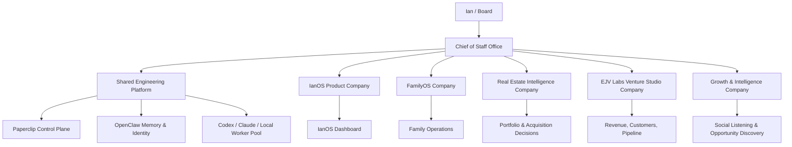
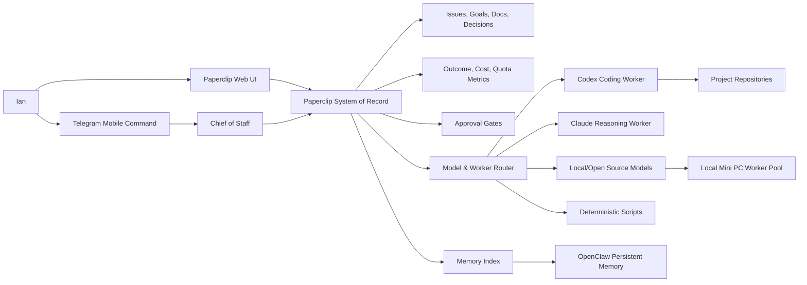
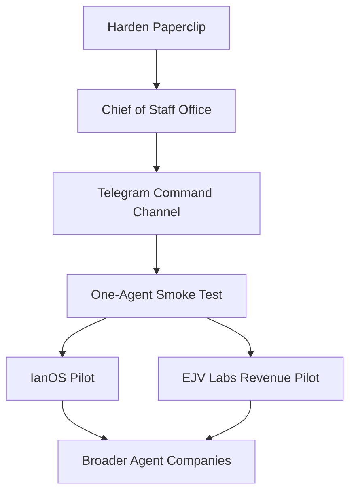

# Paperclip Journey Memo

Date: 2026-05-09

## Executive Summary

Paperclip should become the operating layer for Ian's AI-supported work. The near-term mission is not broad autonomy. It is building a safe, cheap, measurable management system that can coordinate specialized agent companies across IanOS, FamilyOS, real estate intelligence, EJV Labs, and future ventures.

The recommended shape is a multi-company system with one front door: a Chief of Staff office. Ian communicates with the Chief of Staff. The Chief of Staff routes work to the right company, tracks commitments, protects budget, and returns concise decision-ready updates.

Paperclip remains the system of record. Telegram becomes the mobile command channel. OpenClaw provides persistent identity and memory. Codex, Claude, local models, and local mini PCs become bounded execution capacity.

## Why This Matters

Ian's work spans personal operations, family operations, real estate, venture investing, venture studio company building, and software products. A single flat agent team will become noisy and expensive. A multi-company operating model lets each mission have its own context, goals, metrics, and privacy boundary while keeping Ian's interface simple.

The first value target should be revenue and operational leverage, especially for EJV Labs companies. The system should eventually help identify customers, test venture hypotheses, support outreach, analyze markets, and maintain execution cadence.

## Target Operating Model

## Company Blueprint

| Company | Primary Mission | First Outcomes |
| --- | --- | --- |
| Chief of Staff Office | One front door for Ian; routing, follow-up, briefings, prioritization | Daily brief, open-loop tracking, approvals queue |
| Shared Engineering Platform | Paperclip, OpenClaw, adapters, memory, cost, security, local worker pool | Safe agent resumption, model routing, testable infrastructure |
| IanOS Product Company | Build Ian's personal operating dashboard | Dashboard roadmap, integrations, weekly executive view |
| FamilyOS Company | Manage family needs and household operations | Family task/calendar/records intake model |
| Real Estate Intelligence Company | Portfolio analytics and acquisition intelligence | Data map, MSA/acquisition analysis workflow, reporting cadence |
| EJV Labs Venture Studio Company | Help portfolio ventures reach customers and revenue | ICP, lead discovery, outreach workflows, weekly revenue review |
| Growth & Intelligence Company | Social listening, market signals, content, sales support | Signal collection, opportunity briefs, campaign support |

Do not create all companies immediately. Start with Chief of Staff Office and Shared Engineering Platform. Add IanOS and EJV Labs after Paperclip is hardened.

## System Architecture

## Cost Strategy

Paperclip needs a routing layer that chooses the cheapest capable execution path.

| Work Type | Preferred Route | Escalation |
| --- | --- | --- |
| Formatting, extraction, tagging, simple summaries | Local/open-source model or script | Cheap cloud model |
| Triage, status, issue grooming | Cheap cloud model | Sonnet-class reasoning |
| Repo implementation and tests | Codex | Claude only when ambiguity is high |
| Architecture and strategy | Sonnet-class reasoning | Premium model only with Ian approval |
| High-volume social listening | Local pipeline plus cheap model | Stronger model for final synthesis |
| Revenue/customer workflows | Cheap discovery, stronger final review | Ian approval for expensive campaigns |

The system should measure quality and cost by task class so Paperclip learns where Codex, Claude, and local models perform best.

## Measurement Philosophy

Paperclip should show whether work is moving the outcomes Ian cares about:

- revenue progress for EJV Labs companies
- useful product progress on IanOS and FamilyOS
- better decisions in real estate acquisitions and portfolio management
- lower coordination drag for Ian
- lower cost per useful completed task
- fewer uncontrolled loops, stale runs, and unclear blockers

The core dashboard should not be only "how much did agents spend?" It should answer: "What outcomes did this work create, at what cost, and what now needs Ian?"

## Overnight Priorities

1. Harden Paperclip before resuming agents.
2. Build model routing and cost/quality measurement docs.
3. Create a routine registry and pause/resume policy.
4. Design the Chief of Staff and multi-company operating model.
5. Prepare Telegram as a controlled mobile command channel.
6. Leave agents and routines paused unless Ian explicitly approves a tiny smoke test.

## Near-Term Sequence

## Decisions To Preserve

- Paperclip is the system of record.
- Telegram is a command channel, not the record.
- OpenClaw is memory and persistent identity.
- Codex is a preferred coding worker.
- Claude is used deliberately, not as the default for everything.
- Local machines should support cheap background work where quality is sufficient.
- Agents stay paused until control gates are proven.
