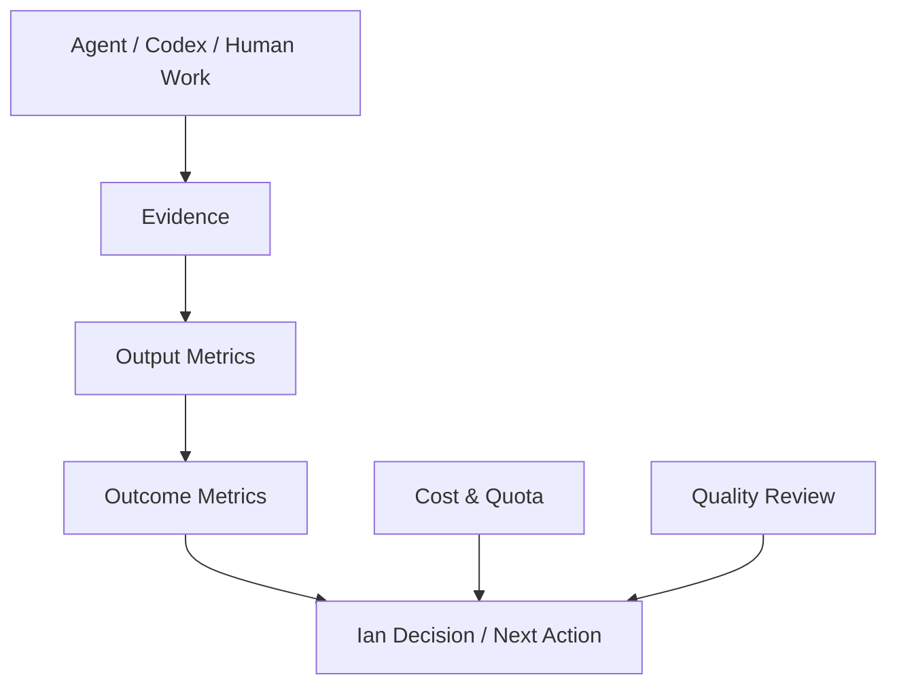

# Outcome Measurement Model

Purpose: define how Paperclip should prove that agent work is delivering Ian's desired outcomes.

## Measurement Layers

## Core Questions

Paperclip should answer these questions every day:

1. What material progress was made?
2. What outcome did it support?
3. What did it cost in dollars, quota, and Ian attention?
4. What is blocked?
5. What needs Ian's decision?
6. Which worker/model routes are performing best?

## Outcome Areas

| Domain | Primary Outcome | Example Leading Indicators |
| --- | --- | --- |
| EJV Labs | Customers and revenue | leads found, outreach sent, calls booked, experiments shipped |
| IanOS | Useful personal operating dashboard | integrations connected, dashboard views shipped, weekly review usage |
| FamilyOS | Lower family coordination load | tasks captured, reminders completed, records organized |
| Real Estate | Better portfolio and acquisition decisions | reports automated, MSA screens completed, deals analyzed |
| Platform | Safer and cheaper AI team | failed runs reduced, quota pressure visible, cost per done issue |

## Work Metrics

Each issue should eventually expose:

- owner
- domain/company
- outcome area
- expected value
- cost class
- risk class
- model/worker route
- status
- evidence
- next decision

## Cost And Quality Metrics

| Metric | Why It Matters |
| --- | --- |
| Cost per done issue | Basic efficiency signal |
| Quota consumed per useful output | Captures subscription pressure even when dollar spend is zero |
| Rework rate | Shows quality problems |
| Time to unblock | Shows management effectiveness |
| Human attention required | Measures whether the system is saving Ian time |
| Completion with evidence | Prevents fake progress |
| Model route success rate | Helps choose Codex vs Claude vs local models |

## Dashboard Concepts

### Daily Operating View

- overnight accomplishments
- blocked items
- approvals needed
- quota/cost state
- top three recommended decisions

### Weekly Outcome View

- revenue pipeline movement
- product milestones shipped
- real estate analysis completed
- family/personal ops wins
- platform reliability and cost trend

### Model Effectiveness View

- tasks by route: Codex, Claude, local model, script, human
- completion rate
- review score
- rework count
- cost/quota per accepted result

## First Implementation Recommendation

Start with lightweight issue metadata and daily summaries before building a heavy dashboard.

Minimum fields:

- `outcomeArea`
- `costClass`: free/local, cheap, standard, premium
- `workerRoute`: codex, claude, local_model, script, human
- `evidenceType`: test, doc, screenshot, data output, customer signal, decision memo
- `impactNote`

These can begin as issue document fields or comment conventions, then move into typed Paperclip fields after the workflow stabilizes.

## Implemented First Surface

Paperclip dashboard summary now includes a `measurement` object:

- `measurement.outcomeAreas`: issue counts grouped by `billingCode`.
- `measurement.workerRoutes`: recent heartbeat runs grouped by adapter type, requested model profile, and model.
- `measurement.routeWindowDays`: the recent-run window used for route effectiveness.
- `measurement.routeRunLimit`: the maximum recent runs included.

Worker route metrics include:

- succeeded, failed, cancelled, other, total
- success rate
- cost USD
- input tokens
- cached input tokens
- output tokens
- model profile fallback count

Current convention:

- Use `billingCode` as the first lightweight outcome-area field.
- Move to typed outcome fields later after the workflow stabilizes.

Recommended starting billing codes:

- `platform-control-plane`
- `ejv-revenue`
- `ianos`
- `familyos`
- `real-estate-intelligence`
- `growth-intelligence`

## Implemented Web View

The main dashboard now renders the measurement payload as:

- `Outcome Areas`: billing-code progress, active/blocked/done counts, and done percentage.
- `Worker Routes`: adapter, requested profile, model, run count, success rate, cost, token volume, and fallback-block count.
- `Quota Watch`: Claude and Codex quota probe status, including provider errors when quota data is unavailable.

This gives Ian a first-pass operating view for the question: "What work is moving which outcome, and what route is it costing us to use?"

## Quota Watch Requirement

Quota visibility is a launch gate for autonomous work. If Claude or Codex quota checks are missing or failing, Paperclip should treat that as an operational risk even when dollar spend reads as zero.

Current desired behavior:

- Surface Claude and Codex quota on the main dashboard.
- Allow same-company agents to read read-only quota status.
- Block cross-company access.
- Prefer explicit provider errors over silent absence.
- Use quota state as an input before unpausing agents, resuming routines, or approving heavy overnight work.
