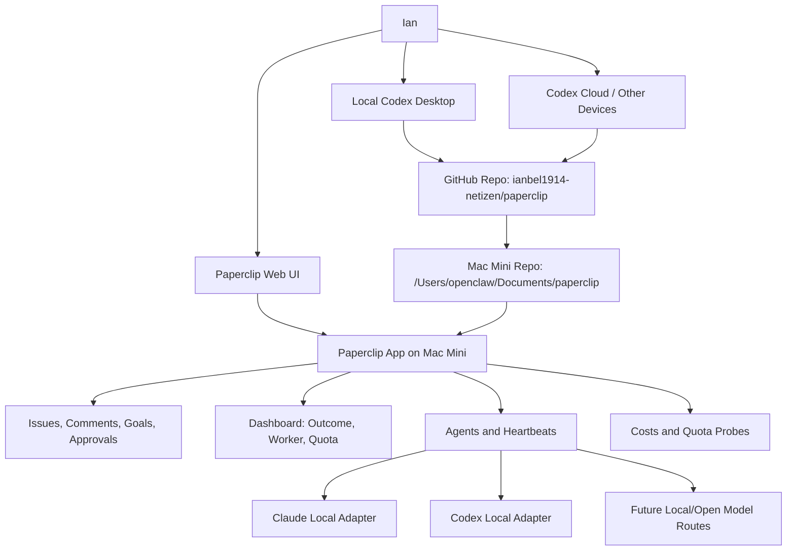
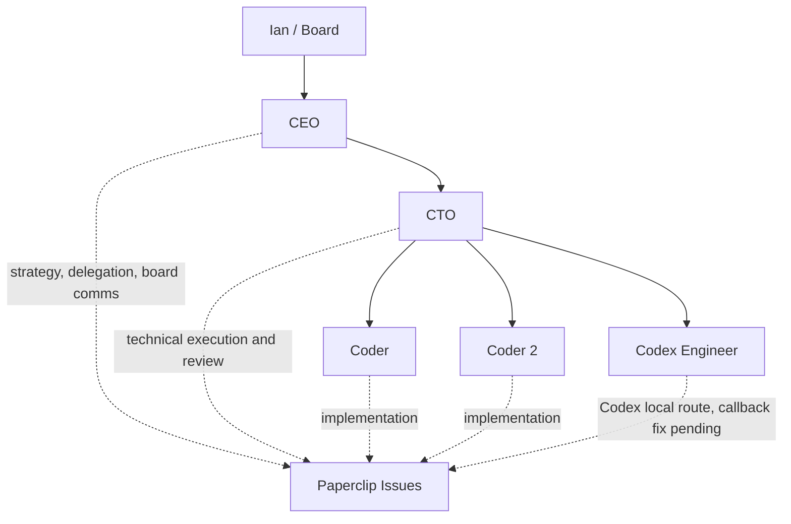
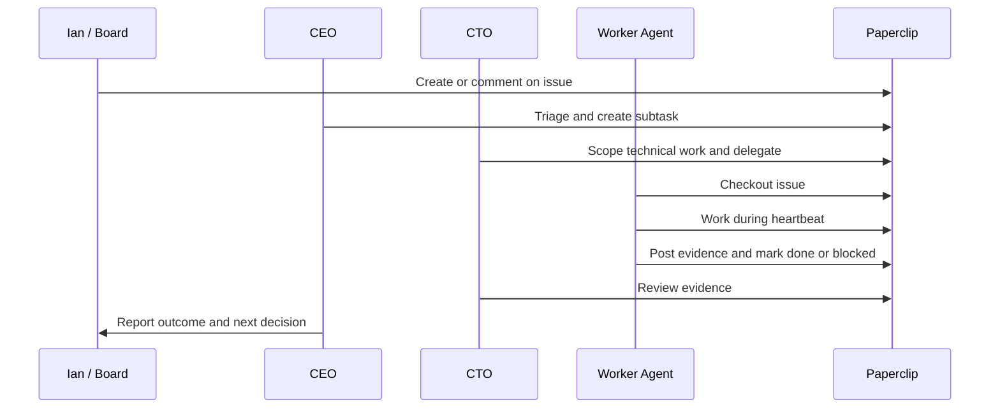
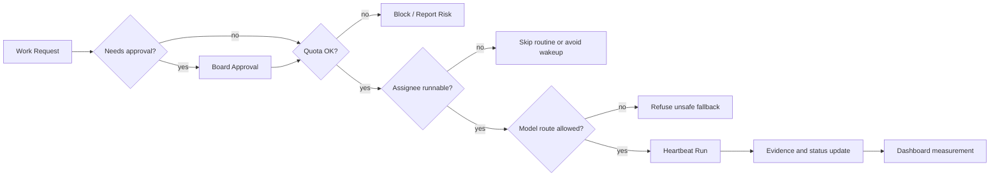
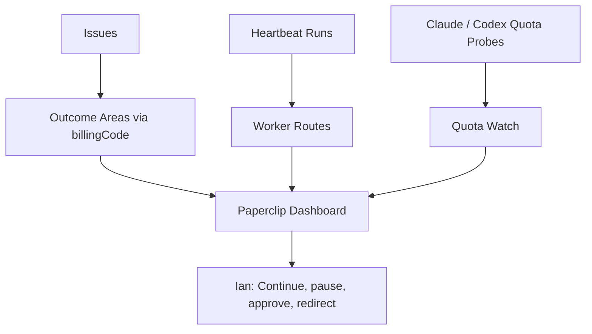
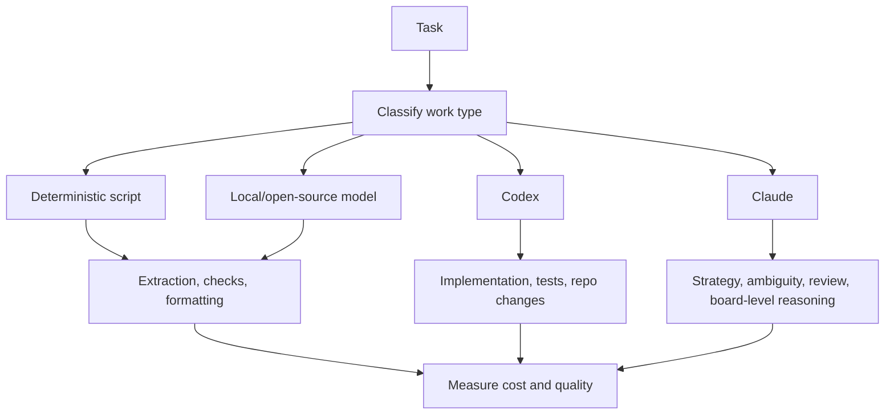
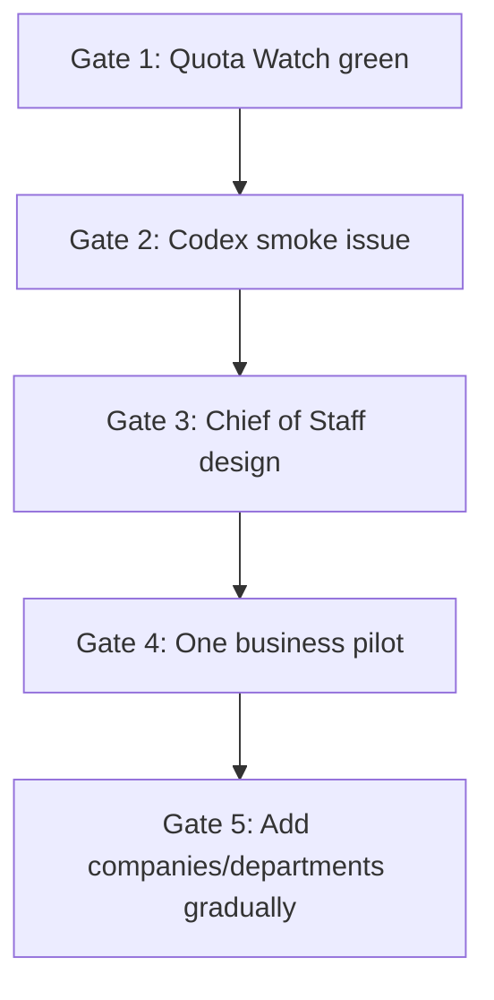

# Paperclip System Memo

Date: 2026-05-14

Purpose: explain what has been built in Paperclip so far, how the system works, and what the next control gates are before using it for larger autonomous work.

## Executive Summary

Paperclip is being turned into Ian's AI operating system: a control plane for persistent agent teams, project memory, issue-based coordination, cost and quota visibility, and portable work across local Codex, cloud Codex, GitHub, and the Mac Mini host.

The important progress so far is not "more agents running." It is safer infrastructure:

- Paperclip can track outcome areas and worker routes on the dashboard.
- Claude and Codex quota visibility is surfaced in Quota Watch.
- Routine dispatch is guarded so paused or unavailable agents do not get woken accidentally.
- Model routing now refuses some unsafe fallback cases instead of silently using a more expensive route.
- Stale queued runs and stale run ids are handled more safely.
- Codex has been added as a controlled Paperclip worker route for the Telegram CoS layer, but live wake-on-demand is temporarily disabled until the callback path is safe.
- GitHub now stores the code and docs branch for portability.

The next move is to complete a tiny Codex smoke test, then use Paperclip to manage one business pilot: the EJV Labs Revenue Engine.

## Current System Map

## Host And Records

| Area | Current source |
| --- | --- |
| Live app | `https://ians-mac-mini-1.tail403c1a.ts.net` |
| Host | Ian Mac Mini on Tailscale, `ian-mac-mini-1` |
| Paperclip repo on host | `/Users/openclaw/Documents/paperclip` |
| Portable GitHub repo | `https://github.com/ianbel1914-netizen/paperclip.git` |
| Working branch | `codex/paperclip-control-plane-handoff` |
| Company | Ian Projects |
| Company id | `a1a88815-804e-4282-ad9c-77107d763374` |
| Main control issue | `IAN-66` |
| Codex smoke issue | `IAN-78` |

## Current Agent Map

Current status:

| Agent | Adapter | Status / posture |
| --- | --- | --- |
| CEO | `claude_local` | Idle |
| CTO | `claude_local` | Paused/manual |
| Coder | `claude_local` | Idle |
| Coder 2 | `claude_local` | Paused/manual |
| Codex Engineer | `codex_local` | Idle, scheduled heartbeats disabled, wake-on-demand disabled pending callback fix |

The Codex Engineer is the intended default smart CoS route for normal Telegram conversation. A live wake test proved Telegram can trigger it, but the `codex_local` runtime could not reach the Paperclip API callback URL from its sandbox and began wasteful continuation attempts. The safe current state is: scheduled heartbeats off, wake-on-demand off, Telegram still records conversation context quietly. CEO/CTO/Coder agent routines remain paused until the Codex communication layer is reliable.

## Issue Lifecycle

Paperclip is the system of record. Agents should leave durable comments, status changes, evidence, blockers, and decisions in issues instead of relying on transient chat context.

## Control Gates We Built Or Strengthened

| Area | What changed | Why it matters |
| --- | --- | --- |
| Dashboard measurement | Added outcome areas grouped by billing code | Shows what work is serving which goal |
| Worker route metrics | Added adapter/profile/model effectiveness | Helps compare Claude, Codex, and future local routes |
| Quota Watch | Surfaced Claude and Codex quota windows | Prevents surprise usage issues |
| Quota endpoint access | Same-company agents can read read-only quota status | Lets agents self-check before work |
| Routine dispatch guard | Skips paused/error/pending/missing assignees | Prevents accidental wakeups |
| Cheap model fallback guard | Refuses if cheap profile cannot be honored | Prevents silent expensive routing |
| Stale queue handling | Cancels invalid queued runs without leaving agents stuck | Improves operational recovery |
| Stale run id handling | Logs safely when run id is malformed or stale | Avoids brittle activity logging failures |

## Outcome Dashboard Model

Current recommended billing codes:

- `platform-control-plane`
- `ejv-revenue`
- `ianos`
- `familyos`
- `real-estate-intelligence`
- `growth-intelligence`

The dashboard should answer: what outcome did work support, what route did it use, what did it cost, and what needs Ian's decision?

## Model And Worker Routing

Routing principle:

- Use scripts or local models when deterministic or cheap work is enough.
- Use Codex for coding and repo work when possible.
- Use Claude deliberately for strategy, ambiguity, review, and leadership tasks.
- Measure route performance before scaling.

## What Has Been Built So Far

### Code And Tests

- Dashboard `measurement` payload for outcome areas and worker route metrics.
- Quota Watch UI for Claude and Codex.
- Quota endpoint same-company read access.
- Routine dispatch guard.
- Heartbeat model profile fallback enforcement.
- Stale queued run invalidation handling.
- Stale run id tolerant auth/activity behavior.
- Tests for dashboard, costs, heartbeat model profile, stale queue invalidation, and routines.

### Docs And Operating Artifacts

- `docs/JOURNEY_MEMO.md`
- `docs/MODEL_ROUTING_POLICY.md`
- `docs/MORNING_BRIEF_2026-05-10.md`
- `docs/OUTCOME_MEASUREMENT.md`
- `docs/OVERNIGHT_WORK_PLAN.md`
- `docs/ROUTINE_REGISTRY.md`
- `docs/TELEGRAM_COMMAND_CHANNEL.md`
- `docs/CODEX_START_HERE.md`
- `docs/CLOUD_PORTABILITY_PLAN.md`
- `docs/PROJECT_ROADMAP.md`
- `docs/PAPERCLIP_SYSTEM_MEMO.md`

### GitHub Portability

The new Paperclip repo gives Ian and future Codex sessions a portable source of truth:

- repo: `https://github.com/ianbel1914-netizen/paperclip.git`
- branch: `codex/paperclip-control-plane-handoff`

This matters because Ian wants to access the project from other desktops, phone, MacBook, and cloud Codex. GitHub should hold code and docs. Paperclip should hold live issues, decisions, agent states, and operating record.

## Current Control Gates

Do not skip Gate 1 and Gate 2. They are how the system proves it can do cheap, controlled work before being trusted with larger overnight execution.

## Recommended Next Step

Run one explicit smoke test only:

- issue: `IAN-78`
- assignee: Codex Engineer
- allowed work: read guardrail docs and post a concise summary
- forbidden work: file edits, tests, subtasks, waking agents, or autonomous continuation

After that, create the EJV Labs Revenue Engine pilot as the first business project, with all work tracked under `ejv-revenue`.

## Open Risks

| Risk | Mitigation |
| --- | --- |
| Agents can spend too much if routines resume broadly | Keep routines paused; require explicit approvals and quota checks |
| Too many companies too early creates management overhead | Start with one front door and one business pilot |
| GitHub and live Paperclip can drift | Keep docs in GitHub, decisions/issues in Paperclip, and cross-link both |
| Codex worker route is unproven inside Paperclip | Run `IAN-78` as a no-code smoke test |
| Local/open model quality is unknown | Benchmark against real low-risk tasks before using at scale |

## Operating Principle

Paperclip should not merely create activity. It should produce useful outcomes at a known cost, with durable evidence, clear next decisions, and no surprise autonomy.
