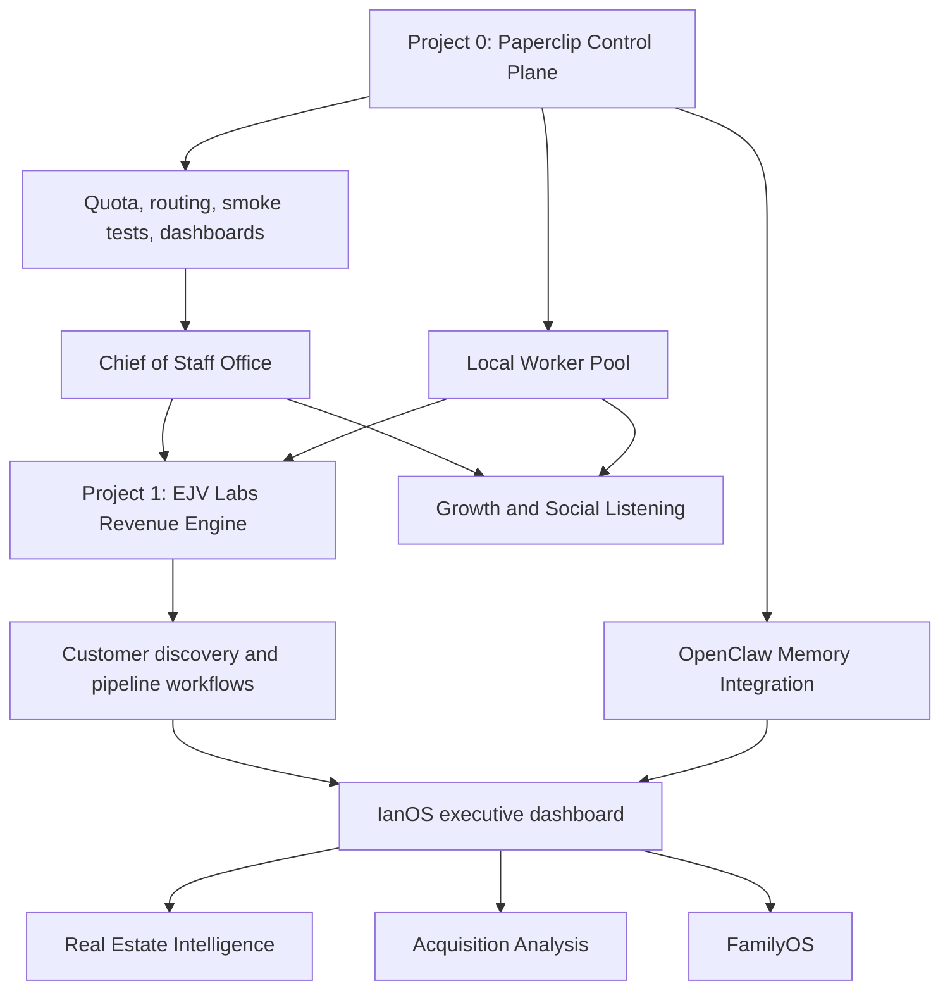

# Paperclip Project Roadmap

Date: 2026-05-14

Purpose: give Ian one planning surface for all available projects, the criteria for prioritizing them, and the recommended first project after Paperclip's control plane is safe enough to use.

## Executive Recommendation

Start with one project, but separate the platform gate from the business project.

- Project 0: finish the Paperclip control plane gate. This is the prerequisite that makes every later project cheaper, safer, and portable.
- Project 1: launch the EJV Labs Revenue Engine pilot. It is closest to revenue, has measurable outcomes, and can teach Paperclip how to coordinate market research, lead discovery, outreach support, product work, and weekly executive review.

IanOS should remain the personal command center vision, but it depends on the platform being stable and on knowing which operating data matters most. The EJV Labs pilot creates real customer and revenue signals first; IanOS can then become the dashboard that shows those signals alongside personal, family, venture, and real estate work.

## Available Projects

| Project | Purpose | First useful outcome | Primary measure |
| --- | --- | --- | --- |
| Paperclip Control Plane | Harden the agent operating system | Safe, observable, low-cost agent work | Green quota checks, no surprise runs, completed smoke tests |
| Chief of Staff Office | One front door for Ian | Daily/weekly brief, routing, open-loop tracking | Ian decisions reduced to a short queue |
| EJV Labs Revenue Engine | Help live ventures get customers | ICPs, lead lists, outreach tests, pipeline review | Qualified leads, calls booked, revenue progress |
| IanOS | Dashboard for Ian's life and work | Executive view across personal, venture, real estate, family | Weekly usage and decision quality |
| Real Estate Portfolio Intelligence | Analyze ~5,500 apartments and portfolio operations | Portfolio reporting and operating dashboards | Faster decisions, automated reporting, variance insights |
| Acquisition Analysis Tool | Screen opportunities across 400 MSAs | Repeatable market and deal scoring workflow | Deals screened, underwriting speed, better filters |
| FamilyOS | Manage family needs and household operations | Shared task/calendar/records intake | Fewer missed tasks, less coordination drag |
| Venture Assessment Machine | Evaluate venture opportunities and portfolio needs | Viability memos and experiment plans | Faster go/no-go decisions |
| Growth and Social Listening | Find new opportunities and customer signals | Signal pipeline and weekly opportunity briefs | Useful signals found, tests launched |
| Telegram Command Channel | Mobile interface to Paperclip | Controlled commands and status from phone | Response reliability and auditability |
| Local Worker Pool | Use mini PCs and local/open models for cheap work | Local routes for tagging, extraction, simple summaries | Cost per task reduced without quality loss |
| OpenClaw Memory Integration | Persistent identity and memory layer | Durable memory contract across sessions and agents | Recall quality and lower repeated context |

## Parking Lot

The parking lot belongs next to Priorities, not inside the active scoring table. It is the place for ideas we want to preserve without pretending they are current commitments.

Access should live inside the `Priorities` page as a separate panel or tab, backed by its own Paperclip document with revision history. That keeps parking lot items easy to find without turning every interesting idea into a scored project.

| Item | Why It Matters | Current Call |
| --- | --- | --- |
| Sports section | Fun should be designed into IanOS and Paperclip. Sports could become a joyful dashboard surface for fandom, trips, fantasy, tickets, memories, family/friend rituals, or playful data experiments. | Keep parked until Ian wants it promoted into a scored project or IanOS module. |
| ClickUp integration | Teams use ClickUp, so Paperclip may eventually need read-only visibility into team task status. The risk is importing ClickUp's mess into Ian's cockpit. | Park until Paperclip drilldowns are stable; promote only as read-only status sync first. |
| Notion integration | Teams use Notion for docs and knowledge. Paperclip should be able to reference that knowledge without requiring Ian to operate out of Notion. | Park until a front needs Notion docs/databases in agent context or drilldown views. |

## Prioritization Criteria

Use this scoring frame when choosing the next project. Score 1-5.

| Criterion | Question |
| --- | --- |
| Strategic value | Does this compound across Ian's work? |
| Revenue immediacy | Can it help customers, pipeline, or revenue soon? |
| Data readiness | Do we have enough data/access to start? |
| Complexity | Can we ship a narrow useful version quickly? |
| Cost and quota risk | Can we run it cheaply and safely? |
| Repeatability | Will the workflow teach Paperclip patterns reused elsewhere? |
| Dependency unlock | Does it unblock other projects? |
| Life fit | Does it increase energy, family time, meaning, and long-term freedom? |

## Initial Scoring

| Project | Strategic | Revenue | Readiness | Speed | Cost Safety | Repeatability | Unlock | Life Fit | Total |
| --- | ---: | ---: | ---: | ---: | ---: | ---: | ---: | ---: | ---: |
| Paperclip Control Plane | 5 | 3 | 5 | 4 | 5 | 5 | 5 | 4 | 36 |
| Chief of Staff Office | 5 | 3 | 4 | 4 | 4 | 5 | 4 | 5 | 34 |
| EJV Labs Revenue Engine | 5 | 5 | 3 | 4 | 3 | 5 | 4 | 3 | 32 |
| Real Estate Portfolio Intelligence | 5 | 4 | 3 | 3 | 3 | 4 | 3 | 4 | 29 |
| IanOS | 5 | 2 | 3 | 3 | 4 | 4 | 4 | 5 | 30 |
| Acquisition Analysis Tool | 5 | 4 | 2 | 3 | 3 | 4 | 3 | 3 | 27 |
| Growth and Social Listening | 4 | 4 | 3 | 3 | 2 | 5 | 3 | 2 | 26 |
| Local Worker Pool | 4 | 1 | 3 | 3 | 5 | 4 | 4 | 4 | 28 |
| OpenClaw Memory Integration | 5 | 1 | 3 | 2 | 4 | 5 | 5 | 4 | 29 |
| FamilyOS | 4 | 1 | 3 | 3 | 4 | 3 | 2 | 5 | 25 |

The score says: finish the control plane, design the Chief of Staff layer in parallel, then make EJV Labs Revenue Engine the first business pilot unless Real Estate Intelligence has an urgent live operating need. The Life Fit score keeps IanOS, FamilyOS, and the Chief of Staff layer visible because fulfillment, family time, and mental load reduction are first-class outcomes.

## Priority Dashboard And Accountability

The Paperclip Priorities page should be the web-accessible cockpit for this roadmap.

Core views:

- Priority rank and total score
- Parking lot for ideas worth remembering but not executing yet
- Recommended attention allocation by project
- Current primary focus and active-watch fronts
- Linked Paperclip front issue status
- Current Ian decision
- Revision history and restore

Chief of Staff accountability behavior:

- Weekly, compare actual work to the dashboard.
- Ask Ian to re-score when a new opportunity or personal need changes the picture.
- Protect one primary focus and at most two active-watch fronts.
- Push back on new work that does not score high enough or lacks a clear life/revenue/platform reason.
- Report evidence, blockers, quota state, and decisions needed.

## Roadmap Map



## Recommended 30/60/90-Day Plan

### Days 0-30: Make Paperclip Safe And Useful

- Keep agents and routines paused unless Ian approves specific smoke tests.
- Finish quota visibility for Claude and Codex.
- Run the Codex Engineer smoke issue and review output quality.
- Add the Chief of Staff operating design.
- Use Paperclip issues as the durable record for project decisions.
- Keep GitHub as the portable code and docs record.

Exit criteria:

- Quota Watch is green or explicitly waived.
- Codex Engineer completes a no-code smoke issue.
- Ian can open the repo and docs from another machine.
- Paperclip dashboard shows outcome areas and worker routes.

### Days 31-60: Run The EJV Labs Revenue Pilot

- Pick one live venture as the first test case.
- Define ICP, offer, customer pain, target channels, and proof points.
- Build lead discovery and outreach support workflows.
- Track weekly pipeline movement in Paperclip.
- Measure cost per useful customer/revenue artifact.

Exit criteria:

- One venture has a weekly revenue operating cadence.
- Paperclip can show leads, experiments, calls, blockers, and next decisions.
- The team can say which worker routes are worth using for revenue work.

### Days 61-90: Turn The Pilot Into A Repeatable Operating System

- Generalize the revenue workflow to other EJV Labs ventures.
- Start IanOS as the cross-domain executive dashboard.
- Add real estate intelligence as the next high-value data-heavy pilot.
- Begin local worker pool experiments for cheap tagging, enrichment, and summarization.
- Define the OpenClaw memory contract for stable long-term recall.

Exit criteria:

- IanOS has a first executive view.
- At least one non-platform project produces recurring weekly value.
- Local/cheap routes are benchmarked against Claude/Codex on real tasks.

## First Project Definition: EJV Labs Revenue Engine

Goal: help one EJV Labs venture get closer to customers and revenue using Paperclip as the management system.

Minimum version:

- Venture profile
- ICP and buyer map
- Lead source list
- Outreach experiment backlog
- Weekly pipeline review
- Evidence log for every completed task
- Cost and route tracking for all agent work

Suggested Paperclip outcome area:

- `ejv-revenue`

First issue template:

```text
Goal: Build the first EJV Labs Revenue Engine pilot for one venture.

Success condition:
- One selected venture has an ICP, target account/persona list, outreach experiment backlog, and weekly review format.
- All work is tracked under billingCode/outcomeArea ejv-revenue.
- No autonomous agent runs beyond explicitly approved smoke tasks until quota gates are green.
```

## Decisions Needed From Ian

1. Which EJV Labs venture should be the first revenue pilot?
2. What counts as success in the first two weeks: leads, calls booked, signed customers, investor/customer discovery, or a different metric?
3. Which systems can Paperclip read first: CRM, email, website analytics, docs, spreadsheets, or social channels?
4. Should the Chief of Staff office be a formal Paperclip company now, or remain a design pattern until the first pilot is proven?

## Operating Principle

Do not create a sprawling agent organization before one project proves the loop. The winning sequence is: safe control plane, one front door, one revenue pilot, measurable outcomes, then expansion.
