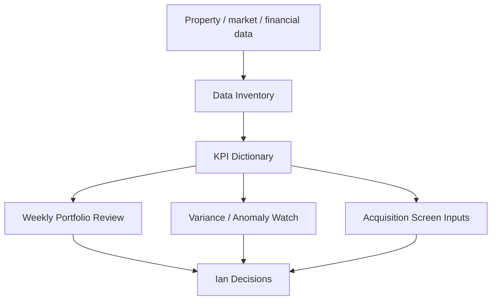

# Real Estate Portfolio Intelligence Front Pack

Date: 2026-05-14

Purpose: define the first operating framework for using Paperclip to improve decisions across Ian's real estate portfolio of roughly 5,500 apartments and future acquisition opportunities.

## Mission

Turn scattered portfolio, market, and operating data into repeatable decision support.

The first version should not try to be a full BI platform. It should create one useful weekly operating loop:

1. What changed?
2. What needs attention?
3. What decisions does Ian need to make?
4. Which properties, MSAs, or deals deserve deeper analysis?

## Priority Rationale

This front may deserve promotion above EJV Revenue if:

- there is a live portfolio reporting deadline
- a lender, investor, partner, or internal team needs analysis
- an operating issue needs attention
- acquisition timing creates a window
- data access is ready enough to produce value quickly

## Operating Map



## Data Inventory

Start by mapping what exists, where it lives, who owns it, and how often it updates.

| Data Area | Examples | First Question |
| --- | --- | --- |
| Property master | property name, units, MSA, vintage, strategy | Do we have one clean property list? |
| Financials | revenue, expense, NOI, budget, variance | What is the source of truth? |
| Operations | occupancy, delinquency, renewals, turns, work orders | Which metrics are updated weekly? |
| Debt/cap table | loan terms, maturity, rate, reserves | Which dates/risks need watch? |
| Market data | rents, supply, employment, population, affordability | Which sources are trusted? |
| Acquisitions | pipeline, pricing, underwriting, MSA score | What is tracked consistently today? |

## KPI Dictionary

First KPI pack:

| KPI | Why It Matters | Frequency |
| --- | --- | --- |
| Occupancy | Demand and execution signal | Weekly |
| Economic occupancy | True collected occupancy | Weekly/monthly |
| Delinquency | Cash and resident quality signal | Weekly |
| Renewal rate | Retention and rent growth signal | Monthly |
| New lease trade-out | Pricing power | Weekly/monthly |
| NOI vs budget | Operating performance | Monthly |
| Expense variance | Controllable cost pressure | Monthly |
| Capex spend vs plan | Execution and capital control | Monthly |
| Debt maturity/rate exposure | Risk and capital planning | Monthly |
| MSA rent/supply trend | Market context | Monthly/quarterly |

## First Dashboard Spec

The v0 dashboard should answer:

1. Which properties need attention this week?
2. Which KPIs moved materially?
3. What changed versus budget?
4. Which decisions are needed?
5. What is the acquisition/market implication?

Views:

- Portfolio overview
- Property exception list
- KPI trend table
- MSA comparison
- Decision queue
- Data quality gaps

## First Analysis Loops

### Weekly Portfolio Review

```text
Portfolio health:

Top positive movers:

Top negative movers:

Exceptions requiring action:

Data gaps:

Decisions needed from Ian:
```

### Property Exception Memo

```text
Property:
Issue:
Evidence:
Likely cause:
Recommended next action:
Owner:
Follow-up date:
```

### Acquisition Market Screen

```text
MSA:
Demand score:
Supply risk:
Affordability:
Rent growth:
Employment/population trend:
Capital markets notes:
Recommendation:
```

## First 30 Days

1. Confirm source systems and accessible exports.
2. Build property master schema.
3. Define KPI dictionary and acceptable data freshness.
4. Create one weekly portfolio review template.
5. Run one manual sample report from available data.
6. Decide whether Real Estate Intelligence should become the first active business pilot.

## Success Criteria

- One reliable property master exists.
- First KPI pack is defined.
- One useful weekly review can be produced manually.
- Data gaps are visible.
- Ian can decide whether to promote this above EJV Revenue.

## Open Questions For Ian

1. What are the current source systems for portfolio data?
2. Is the first need operating performance, investor/lender reporting, acquisition screening, or all three?
3. Which properties or MSAs are most important right now?
4. What format is most useful: dashboard, memo, spreadsheet, or all three?
5. Who on the real estate team owns the data exports?
